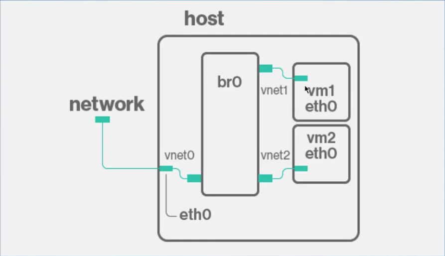

# Network Bridging:

<hr><hr>

* Network briding is used in a virtualization environment (KVM)
* It is used to make the physical network interface card accessed by all virtual machines
* A virtual bridge interface will be created to link the VM's to the physical NIC of the host server



## Bridge Coniguration:


### Check the current connection and interface settings on host vm09 (10.0.2.09):

```
[root@vm09 ~]# nmcli con show
NAME    UUID                                  TYPE      DEVICE 
enp0s3  fad7c00c-cff2-43bd-b76e-1f01c409a8a9  ethernet  enp0s3 
enp0s8  5cf51933-3886-4a4e-95bc-14e1422a4b1e  ethernet  --
[root@vm09 ~]# nmcli dev status
DEVICE  TYPE      STATE         CONNECTION 
enp0s3  ethernet  connected     enp0s3     
enp0s8  ethernet  disconnected  --         
lo      loopback  unmanaged     --
```

### Install the bridge utilities package:

```
[root@vm09 ~]# yum install -y bridge-utils
Loaded plugins: fastestmirror, langpacks
Determining fastest mirrors
 * base: centos-distro.1gservers.com
 * extras: mirror.web-ster.com
 * updates: mirror.sfo12.us.leaseweb.net
base                                         | 3.6 kB     00:00     
extras                                       | 3.4 kB     00:00     
updates                                      | 3.4 kB     00:00     
(1/4): base/7/x86_64/group_gz                  | 166 kB   00:00     
(2/4): extras/7/x86_64/primary_db              | 147 kB   00:00     
(3/4): updates/7/x86_64/primary_db             | 2.0 MB   00:00     
(4/4): base/7/x86_64/primary_db                | 5.9 MB   00:02     
Package bridge-utils-1.5-9.el7.x86_64 already installed and latest version
Nothing to do
```

### Add a new bridged connection:

```
[root@vm09 ~]# nmcli con add type bridge con-name br0 ifname br0 autoconnect yes
Connection 'br0' (b5383822-fc56-4e58-b784-b7ab880018a6) successfully added.
```

### Check changes to device status:

```
[root@vm09 ~]# nmcli dev status
DEVICE  TYPE      STATE                                  CONNECTION 
enp0s3  ethernet  connected                              enp0s3     
br0     bridge    connecting (getting IP configuration)  br0        
enp0s8  ethernet  disconnected                           --         
lo      loopback  unmanaged                              --
```

### Disconnect the enp0s3 interface

```
[root@vm09 ~]# nmcli dev disconnect enp0s3
Device 'enp0s3' successfully disconnected.
```

### Configure enp0s3 as a slave to br0

```
[root@vm09 ~]# nmcli con add type bridge-slave ifname enp0s3 con-name br0-nic autoconnect yes master br0
Connection 'br0-nic' (707e6a7f-0269-448f-bc91-0e6c3db01a5a) successfully added.
```

### Bring up the bridged connection:

```
[root@vm09 ~]# nmcli connection up br0
Connection successfully activated (master waiting for slaves) (D-Bus active path: /org/freedesktop/NetworkManager/ActiveConnection/3)
```

### Add ipv4 and gateway to the bridged connection:

```
[root@vm09 ~]# nmcli con mod br0 ipv4.addresses 10.0.2.9/24 ipv4.gateway 10.0.2.1
```

### Configurre address as static:

```
[root@vm09 ~]# nmcli con mod br0 ipv4.method manual
```

### Bring up br0-nic:

```
[root@vm09 ~]# nmcli con up br0-nic
Connection successfully activated (D-Bus active path: /org/freedesktop/NetworkManager/ActiveConnection/4)
```

### Restart the network and query our connections:

```
[root@vm09 ~]# nmcli con show
NAME     UUID                                  TYPE      DEVICE 
br0      b5383822-fc56-4e58-b784-b7ab880018a6  bridge    br0    
br0-nic  707e6a7f-0269-448f-bc91-0e6c3db01a5a  ethernet  enp0s3 
enp0s3   fad7c00c-cff2-43bd-b76e-1f01c409a8a9  ethernet  --     
enp0s8   5cf51933-3886-4a4e-95bc-14e1422a4b1e  ethernet  --
```

### Confirm static ipv4 as specified:

```
br0: flags=4163<UP,BROADCAST,RUNNING,MULTICAST>  mtu 1500
        inet 10.0.2.9  netmask 255.255.255.0  broadcast 10.0.2.255
        inet6 fe80::a00:27ff:fe24:4c62  prefixlen 64  scopeid 0x20<link>
        ether 08:00:27:24:4c:62  txqueuelen 1000  (Ethernet)
        RX packets 24  bytes 2258 (2.2 KiB)
        RX errors 0  dropped 0  overruns 0  frame 0
        TX packets 13  bytes 1050 (1.0 KiB)
        TX errors 0  dropped 0 overruns 0  carrier 0  collisions 0

enp0s3: flags=4163<UP,BROADCAST,RUNNING,MULTICAST>  mtu 1500
        ether 08:00:27:24:4c:62  txqueuelen 1000  (Ethernet)
        RX packets 6774  bytes 8989464 (8.5 MiB)
        RX errors 0  dropped 0  overruns 0  frame 0
        TX packets 1908  bytes 121573 (118.7 KiB)
        TX errors 0  dropped 0 overruns 0  carrier 0  collisions 0

enp0s8: flags=4163<UP,BROADCAST,RUNNING,MULTICAST>  mtu 1500
        ether 08:00:27:6c:1e:9d  txqueuelen 1000  (Ethernet)
        RX packets 0  bytes 0 (0.0 B)
        RX errors 0  dropped 0  overruns 0  frame 0
        TX packets 0  bytes 0 (0.0 B)
        TX errors 0  dropped 0 overruns 0  carrier 0  collisions 0

lo: flags=73<UP,LOOPBACK,RUNNING>  mtu 65536
        inet 127.0.0.1  netmask 255.0.0.0
        inet6 ::1  prefixlen 128  scopeid 0x10<host>
        loop  txqueuelen 1000  (Local Loopback)
        RX packets 2  bytes 208 (208.0 B)
        RX errors 0  dropped 0  overruns 0  frame 0
        TX packets 2  bytes 208 (208.0 B)
        TX errors 0  dropped 0 overruns 0  carrier 0  collisions 0
```

### Show the device and bridge status:

```
[root@vm09 ~]# nmcli dev status
DEVICE  TYPE      STATE         CONNECTION 
br0     bridge    connected     br0        
enp0s3  ethernet  connected     br0-nic    
enp0s8  ethernet  disconnected  --         
lo      loopback  unmanaged     --         
[root@vm09 ~]# brctl show
bridge name     bridge id               STP enabled     interfaces
br0             8000.080027244c62       yes             enp0s3
```

### Everything is configured, we are now bridged to our host network.

<hr><hr>

