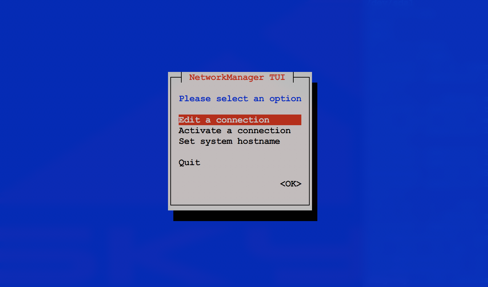
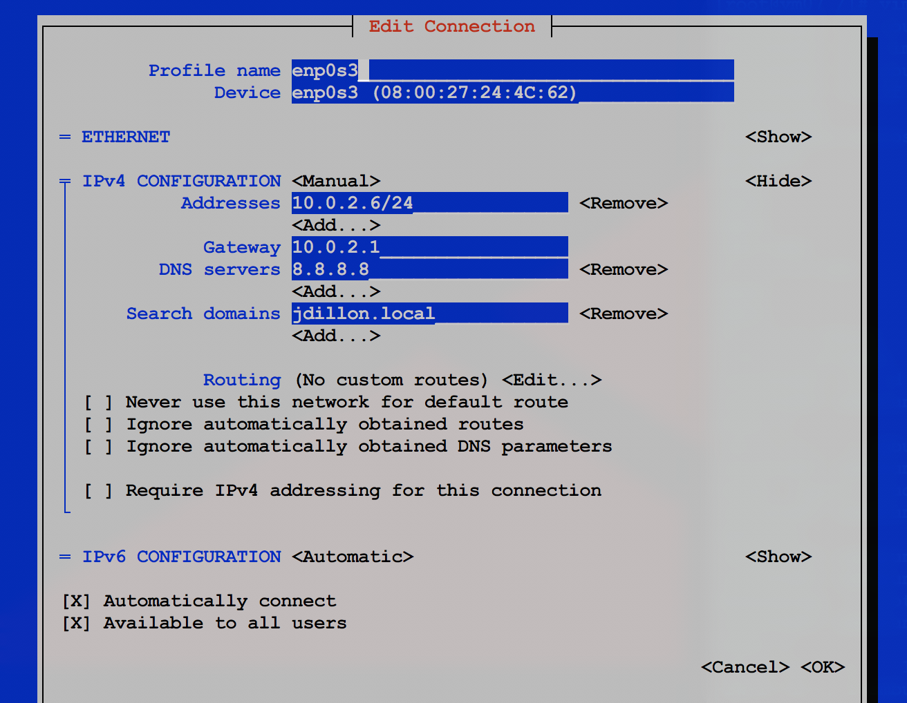

# Network Manager Configuration:

<hr><hr>

### NetworkManager relies on two main command routes:
* NMTUI(Text/Graphic Configuration)
* NMCLI(Command Line Interface)

### Running the nmtui command from terminal, brings up the user interface:

`[root@masterhost06 ~]# nmtui`



### The graphic interface gives the admin full access of current network connections, as well as the ability to create new configurations

### We can view the current configuration of the enpos3 interface (static ip address has already been established for this host):



### We see that these parameters are reflected in our general ip configuration:

```
[root@masterhost06 ~]# ip addr show
1: lo: <LOOPBACK,UP,LOWER_UP> mtu 65536 qdisc noqueue state UNKNOWN group default qlen 1000
    link/loopback 00:00:00:00:00:00 brd 00:00:00:00:00:00
    inet 127.0.0.1/8 scope host lo
       valid_lft forever preferred_lft forever
    inet6 ::1/128 scope host
       valid_lft forever preferred_lft forever
2: enp0s3: <BROADCAST,MULTICAST,UP,LOWER_UP> mtu 1500 qdisc pfifo_fast state UP group default qlen 1000
    link/ether 08:00:27:24:4c:62 brd ff:ff:ff:ff:ff:ff
    inet 10.0.2.6/24 brd 10.0.2.255 scope global noprefixroute enp0s3
       valid_lft forever preferred_lft forever
    inet6 fe80::836d:9908:8dca:353a/64 scope link noprefixroute
       valid_lft forever preferred_lft forever
3: enp0s8: <BROADCAST,MULTICAST,UP,LOWER_UP> mtu 1500 qdisc pfifo_fast state UP group default qlen 1000
    link/ether 08:00:27:6c:1e:9d brd ff:ff:ff:ff:ff:ff
4: enp0s9: <BROADCAST,MULTICAST,UP,LOWER_UP> mtu 1500 qdisc pfifo_fast state UP group default qlen 1000
    link/ether 08:00:27:81:c3:13 brd ff:ff:ff:ff:ff:ff
    inet 192.168.56.3/24 brd 192.168.56.255 scope global noprefixroute dynamic enp0s9
       valid_lft 919sec preferred_lft 919sec
    inet6 fe80::2bd6:95a1:88f:61b/64 scope link noprefixroute
       valid_lft forever preferred_lft forever
```

### As mentioned, nmcli is our command line interface for interacting with the NetworkManager

```
[root@masterhost06 ~]# nmcli device show
GENERAL.DEVICE:                         enp0s3
GENERAL.TYPE:                           ethernet
GENERAL.HWADDR:                         08:00:27:24:4C:62
GENERAL.MTU:                            1500
GENERAL.STATE:                          100 (connected)
GENERAL.CONNECTION:                     enp0s3
GENERAL.CON-PATH:                       /org/freedesktop/NetworkManager/ActiveConnection/3
WIRED-PROPERTIES.CARRIER:               on
IP4.ADDRESS[1]:                         10.0.2.6/24
IP4.GATEWAY:                            10.0.2.1
GENERAL.DEVICE:                         enp0s3
GENERAL.TYPE:                           ethernet
GENERAL.HWADDR:                         08:00:27:24:4C:62
GENERAL.MTU:                            1500
GENERAL.STATE:                          100 (connected)
GENERAL.CONNECTION:                     enp0s3
GENERAL.CON-PATH:                       /org/freedesktop/NetworkManager/ActiveConnection/3
WIRED-PROPERTIES.CARRIER:               on
IP4.ADDRESS[1]:                         10.0.2.6/24
IP4.GATEWAY:                            10.0.2.1
IP4.ROUTE[1]:                           dst = 10.0.2.0/24, nh = 0.0.0.0, mt = 102
IP4.ROUTE[2]:                           dst = 0.0.0.0/0, nh = 10.0.2.1, mt = 102
IP4.DNS[1]:                             8.8.8.8
IP6.ADDRESS[1]:                         fe80::836d:9908:8dca:353a/64
IP6.GATEWAY:                            --
IP6.ROUTE[1]:                           dst = ff00::/8, nh = ::, mt = 256, table=255
IP6.ROUTE[2]:                           dst = fe80::/64, nh = ::, mt = 256
IP6.ROUTE[3]:                           dst = fe80::/64, nh = ::, mt = 102

GENERAL.DEVICE:                         enp0s9
GENERAL.TYPE:                           ethernet
GENERAL.HWADDR:                         08:00:27:81:C3:13
GENERAL.MTU:                            1500
GENERAL.STATE:                          100 (connected)
GENERAL.CONNECTION:                     Wired connection 1
GENERAL.CON-PATH:                       /org/freedesktop/NetworkManager/ActiveConnection/2
WIRED-PROPERTIES.CARRIER:               on
IP4.ADDRESS[1]:                         192.168.56.3/24
IP4.GATEWAY:                            --
IP4.ROUTE[1]:                           dst = 192.168.56.0/24, nh = 0.0.0.0, mt = 101
IP6.ADDRESS[1]:                         fe80::2bd6:95a1:88f:61b/64
IP6.GATEWAY:                            --
IP6.ROUTE[1]:                           dst = ff00::/8, nh = ::, mt = 256, table=255
IP6.ROUTE[2]:                           dst = fe80::/64, nh = ::, mt = 256
IP6.ROUTE[3]:                           dst = fe80::/64, nh = ::, mt = 101

GENERAL.DEVICE:                         enp0s8
GENERAL.TYPE:                           ethernet
GENERAL.HWADDR:                         08:00:27:6C:1E:9D
GENERAL.MTU:                            1500
GENERAL.STATE:                          30 (disconnected)
GENERAL.CONNECTION:                     --
GENERAL.CON-PATH:                       --
WIRED-PROPERTIES.CARRIER:               on

GENERAL.DEVICE:                         lo
GENERAL.TYPE:                           loopback
GENERAL.HWADDR:                         00:00:00:00:00:00
GENERAL.MTU:                            65536
GENERAL.STATE:                          10 (unmanaged)
GENERAL.CONNECTION:                     --
GENERAL.CON-PATH:                       --
IP4.ADDRESS[1]:                         127.0.0.1/8
IP4.GATEWAY:                            --
IP6.ADDRESS[1]:                         ::1/128
IP6.GATEWAY:                            --
```

### We can view our connected interfaces:

```
[root@masterhost06 ~]# nmcli device status
DEVICE  TYPE      STATE         CONNECTION
enp0s3  ethernet  connected     enp0s3
enp0s9  ethernet  connected     Wired connection 1
enp0s8  ethernet  disconnected  --
lo      loopback  unmanaged     --
```

### Show current connections:

```
[root@masterhost06 ~]# nmcli connection show
NAME                UUID                                  TYPE      DEVICE
Wired connection 1  cabb1b27-39e4-3b7f-a7cc-5034a94c8306  ethernet  enp0s9
enp0s3              fad7c00c-cff2-43bd-b76e-1f01c409a8a6  ethernet  enp0s3
enp0s8              5cf51933-3886-4a4e-95bc-14e1422a4b1e  ethernet  --
```

### We can add a connection via nmcli:

```
[root@masterhost06 ~]# nmcli connection add con-name course ifname eno50332192 autoconnect yes type ethernet
Connection 'course' (834e8bdc-e5e5-4c56-ba0b-5a964330cd4e) successfully added.
```

```
[root@masterhost06 ~]# nmcli connection show
NAME                UUID                                  TYPE      DEVICE
Wired connection 1  cabb1b27-39e4-3b7f-a7cc-5034a94c8306  ethernet  enp0s9
enp0s3              fad7c00c-cff2-43bd-b76e-1f01c409a8a6  ethernet  enp0s3
course              834e8bdc-e5e5-4c56-ba0b-5a964330cd4e  ethernet  --
enp0s8              5cf51933-3886-4a4e-95bc-14e1422a4b1e  ethernet  --
```

### Assign an ip address to the new connection:

```
[root@masterhost06 ~]# nmcli connection modify course ipv4.addresses 10.0.2.7/24 ipv4.gateway 10.0.2.1 ipv4.dns 8.8.8.8
```

### Remove the connection:

```
[root@masterhost06 ~]# nmcli connection delete
course                enp0s8                id                    uuid
enp0s3                help                  path                  Wired\ connection\ 1
[root@masterhost06 ~]# nmcli connection delete course
Connection 'course' (834e8bdc-e5e5-4c56-ba0b-5a964330cd4e) successfully deleted.
```

```
[root@masterhost06 ~]# nmcli connection show
NAME                UUID                                  TYPE      DEVICE
Wired connection 1  cabb1b27-39e4-3b7f-a7cc-5034a94c8306  ethernet  enp0s9
enp0s3              fad7c00c-cff2-43bd-b76e-1f01c409a8a6  ethernet  enp0s3
enp0s8              5cf51933-3886-4a4e-95bc-14e1422a4b1e  ethernet  --
```

### Both nmtui and nmcli are useful, powerful tools for managing network connections.  Perhaps the most direct option (for advanced users), is to edit the interface files directly:

`[root@masterhost06 ~]# vim /etc/sysconfig/network-scripts/ifcfg-enp0s3`

```
TYPE=Ethernet
PROXY_METHOD=none
BROWSER_ONLY=no
BOOTPROTO=static
DEFROUTE=yes
IPV4_FAILURE_FATAL=no
IPV6INIT=yes
IPV6_AUTOCONF=yes
IPV6_DEFROUTE=yes
IPV6_FAILURE_FATAL=no
IPV6_ADDR_GEN_MODE=stable-privacy
NAME=enp0s3
UUID=fad7c00c-cff2-43bd-b76e-1f01c409a8a6
DEVICE=enp0s3
ONBOOT=yes
IPADDR=10.0.2.6
GATEWAY=10.0.2.1
NETMASK=255.255.255.0
DOMAIN=jdillon.local
DNS1=8.8.8.8
ZONE=public
PREFIX=24
```

### Altering these parameters, serves the same purpose as using either nmcli or nmtui.  If one chooses to go this direct route, it is generally considered a best practice to stop and disable the NetworkManager service (as the daemon may override manual configuration options from time to time).

<hr><hr>
