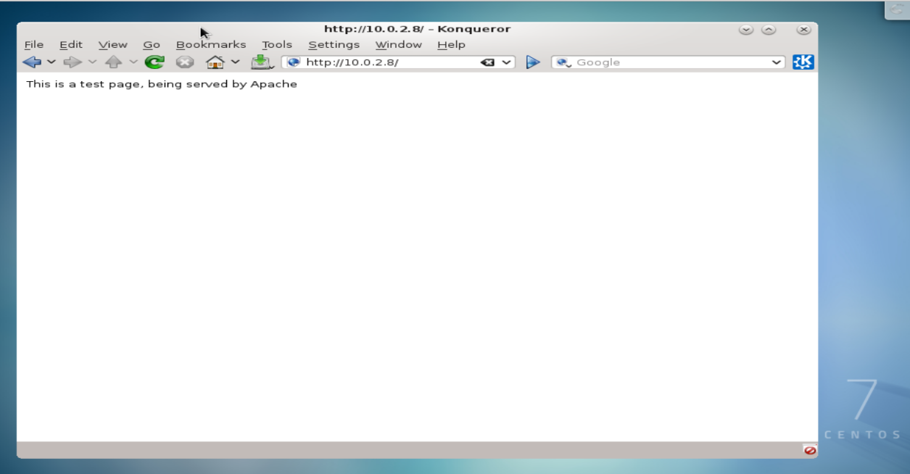
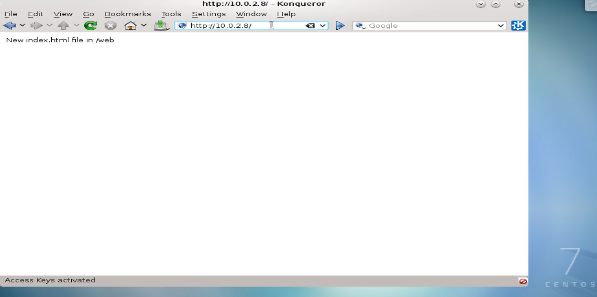

# Simple Web-Site Creation:
<hr><hr>
### (Apache server will be configured on vm08 [10.0.2.8])

### Apache is installed via the httpd package:

```
[root@vm08 ~]# yum -y install httpd
Loaded plugins: fastestmirror, langpacks
Loading mirror speeds from cached hostfile
 * base: mirrors.ocf.berkeley.edu
 * extras: mirrors.xmission.com
 * updates: centos.sonn.com
Resolving Dependencies
--> Running transaction check
---> Package httpd.x86_64 0:2.4.6-80.el7.centos.1 will be installed
--> Processing Dependency: httpd-tools = 2.4.6-80.el7.centos.1 for package: httpd-2.4.6-80.el7.centos.1.x86_64
--> Processing Dependency: libaprutil-1.so.0()(64bit) for package: httpd-2.4.6-80.el7.centos.1.x86_64
--> Processing Dependency: libapr-1.so.0()(64bit) for package: httpd-2.4.6-80.el7.centos.1.x86_64
--> Running transaction check
---> Package apr.x86_64 0:1.4.8-3.el7_4.1 will be installed
---> Package apr-util.x86_64 0:1.5.2-6.el7 will be installed
---> Package httpd-tools.x86_64 0:2.4.6-80.el7.centos.1 will be installed
--> Finished Dependency Resolution

Dependencies Resolved

==============================================================================================================
 Package                  Arch                Version                              Repository            Size
==============================================================================================================
Installing:
 httpd                    x86_64              2.4.6-80.el7.centos.1                updates              2.7 M
Installing for dependencies:
 apr                      x86_64              1.4.8-3.el7_4.1                      base                 103 k
 apr-util                 x86_64              1.5.2-6.el7                          base                  92 k
 httpd-tools              x86_64              2.4.6-80.el7.centos.1                updates               90 k

Transaction Summary
==============================================================================================================
Install  1 Package (+3 Dependent packages)

Total download size: 3.0 M
Installed size: 9.9 M
Downloading packages:
(1/4): apr-1.4.8-3.el7_4.1.x86_64.rpm                                                  | 103 kB  00:00:00
(2/4): httpd-tools-2.4.6-80.el7.centos.1.x86_64.rpm                                    |  90 kB  00:00:00
(3/4): apr-util-1.5.2-6.el7.x86_64.rpm                                                 |  92 kB  00:00:00
(4/4): httpd-2.4.6-80.el7.centos.1.x86_64.rpm                                          | 2.7 MB  00:00:01
--------------------------------------------------------------------------------------------------------------
Total                                                                         2.5 MB/s | 3.0 MB  00:00:01
Running transaction check
Running transaction test
Transaction test succeeded
Running transaction
  Installing : apr-1.4.8-3.el7_4.1.x86_64                                                                 1/4
  Installing : apr-util-1.5.2-6.el7.x86_64                                                                2/4
  Installing : httpd-tools-2.4.6-80.el7.centos.1.x86_64                                                   3/4
  Installing : httpd-2.4.6-80.el7.centos.1.x86_64                                                         4/4
  Verifying  : httpd-tools-2.4.6-80.el7.centos.1.x86_64                                                   1/4
  Verifying  : apr-util-1.5.2-6.el7.x86_64                                                                2/4
  Verifying  : apr-1.4.8-3.el7_4.1.x86_64                                                                 3/4
  Verifying  : httpd-2.4.6-80.el7.centos.1.x86_64                                                         4/4

Installed:
  httpd.x86_64 0:2.4.6-80.el7.centos.1

Dependency Installed:
  apr.x86_64 0:1.4.8-3.el7_4.1   apr-util.x86_64 0:1.5.2-6.el7   httpd-tools.x86_64 0:2.4.6-80.el7.centos.1

Complete!
```

### Enable httpd and allow it through the firewall:

```
[root@vm08 ~]# systemctl enable httpd
Created symlink from /etc/systemd/system/multi-user.target.wants/httpd.service to /usr/lib/systemd/system/httpd.service.
[root@vm08 ~]# firewall-cmd --add-service=http --permanent
success
[root@vm08 ~]# firewall-cmd --reload
success
```

### The main configuration files are in /etc/httpd/:

```
[root@vm08 ~]# cd /etc/httpd/
[root@vm08 httpd]# ls
conf  conf.d  conf.modules.d  logs  modules  run
```

### Within the httpd.conf file, we need to know where our document base currently lives:

```
[root@vm08 httpd]# cd conf
[root@vm08 conf]# ls
httpd.conf  magic
[root@vm08 conf]# cat httpd.conf | grep "DocumentRoot"
# DocumentRoot: The directory out of which you will serve your
DocumentRoot "/var/www/html"
```

### This effectively means that the Apache server will be looking for .html files in /var/www/html.

### We can create a test html.index page within this directory, to see the Apache server serving pages on localhost:

```
[root@vm08 conf]# cd /var/www/html
[root@vm08 html]# ls
[root@vm08 html]# touch index.html
[root@vm08 html]# chmod 755 index.html
[root@vm08 html]# echo "This is a test page, being served by Apache" >> index.html
```

### Start httpd service:

`[root@vm08 html]# systemctl restart httpd`

### Next, we can look for our index page by pointing a web-browser to our IP address:



### We see that our index.html file is being properly loaded from the /var/www/html directory.

## What if we wanted to change the html document base?

### This is relatively straightforward.  First we must change our DocumentRoot parameter everywhere that it exists in /etc/httpd/conf/httpd.conf.  We will create a new html directory to serve pages, in a new directory named /web:

```
[root@vm08 conf]# mkdir /web
[root@vm08 conf]# vim /etc/httpd/conf/httpd.conf
```

```
DocumentRoot "/web"

<Directory "/web">
    AllowOverride None
    # Allow open access:
    Require all granted
</Directory>
```

### Next, we need to recreate the SELinux context from the original directory in the new /web directory:

```
[root@vm08 conf]# ls -lZ /var/www/html
-rwxr-xr-x. root root unconfined_u:object_r:httpd_sys_content_t:s0 index.html
[root@vm08 conf]# cd /web
[root@vm08 web]# touch /web/index.html
[root@vm08 web]# echo "New index.html file in /web" >> /web/index.html
[root@vm08 conf]# semanage fcontext -a -t httpd_sys_content_t "/web(/.*)"?
[root@vm08 web]# ls -lZ /web
-rw-r--r--. root root unconfined_u:object_r:default_t:s0 index.html
[root@vm08 /]# restorecon -Rv /web/
restorecon reset /web context unconfined_u:object_r:default_t:s0->unconfined_u:object_r:httpd_sys_content_t:s0
restorecon reset /web/index.html context unconfined_u:object_r:default_t:s0->unconfined_u:object_r:httpd_sys_content_t:s0
[root@vm08 /]# ls -lZ /web
-rw-r--r--. root root unconfined_u:object_r:httpd_sys_content_t:s0 index.html
[root@vm08 web]# systemctl restart httpd
```

### Now, we can test to make sure Apache is serving pages from our new directory:



<hr><hr>
