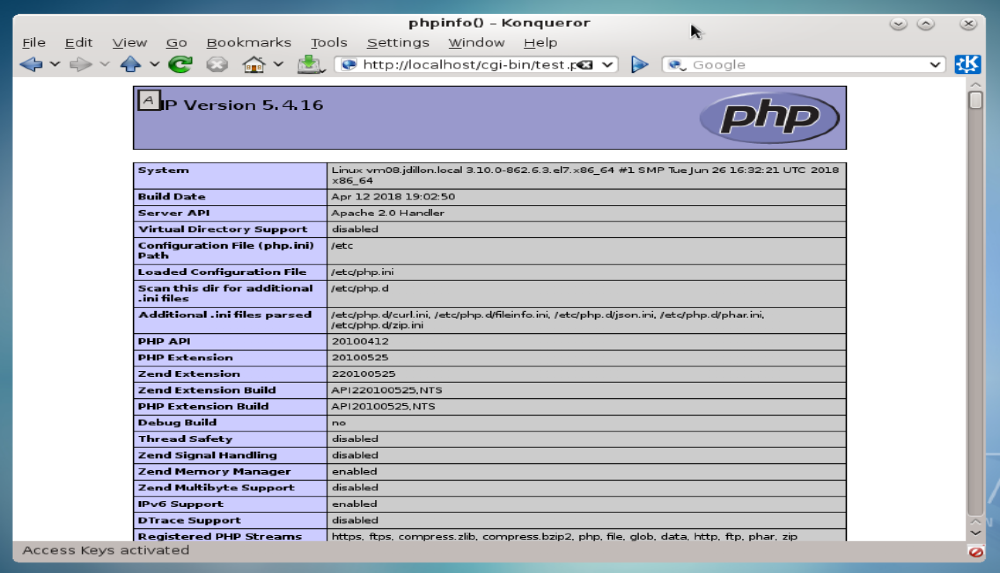

# CGI Application Deployment:

<hr><hr>

### CGI applications allow a website to work with dynamic content via various languages (Python, Perl, PHP, etc...)

### We will demo an example using PHP.  Let's first ensure we have an updated version of PHP on vm08 (10.0.2.8):

```
[root@vm08 logs]# yum -y install php

Installed:
  php.x86_64 0:5.4.16-45.el7

Dependency Installed:
  libzip.x86_64 0:0.10.1-8.el7                     php-cli.x86_64 0:5.4.16-45.el7                     php-common.x86_64 0:5.4.16-45.el7

Complete!
```

### We will create a CGI script in our cgi directory (per Apache config file) /var/www/cgi-bin/:

`[root@vm08 logs]# vim /var/www/cgi-bin/test.php`

```
<?php

   /*For demonstration purposes of CGI functionality
     we will simply display php version info in the browser
   */
   phpinfo();
?>
```

### This file must be user and group owned by Apache

```
[root@vm08 logs]# chown apache:apache /var/www/cgi-bin/test.php
[root@vm08 logs]# chmod a+x /var/www/cgi-bin/test.php
```

### We must also adjust the SELinux context for CGI scripts in the /var/www/ directory:

```
[root@vm08 logs]# semanage fcontext -a -t httpd_sys_script_exec_t "/var/www/(./*)"?
[root@vm08 logs]# restorecon -Rv /var/www/
[root@vm08 logs]# systemctl restart httpd
```

### As a reminder, even though we had changed our primary document root to /web, the CGI directory is still configured as such:

```
<IfModule alias_module>
    #
    # Redirect: Allows you to tell clients about documents that used to
    # exist in your server's namespace, but do not anymore. The client
    # will make a new request for the document at its new location.
    # Example:
    # Redirect permanent /foo http://www.example.com/bar

    #
    # Alias: Maps web paths into filesystem paths and is used to
    # access content that does not live under the DocumentRoot.
    # Example:
    # Alias /webpath /full/filesystem/path
    #
    # If you include a trailing / on /webpath then the server will
    # require it to be present in the URL.  You will also likely
    # need to provide a <Directory> section to allow access to
    # the filesystem path.

    #
    # ScriptAlias: This controls which directories contain server scripts.
    # ScriptAliases are essentially the same as Aliases, except that
    # documents in the target directory are treated as applications and
    # run by the server when requested rather than as documents sent to the
    # client.  The same rules about trailing "/" apply to ScriptAlias
    # directives as to Alias.
    #
    ScriptAlias /cgi-bin/ "/var/www/cgi-bin/"

</IfModule>

#
# "/var/www/cgi-bin" should be changed to whatever your ScriptAliased
# CGI directory exists, if you have that configured.
#
<Directory "/var/www/cgi-bin">
    AllowOverride None
    Options None
    Require all granted
</Directory>

```

### These are the Apache default parameters.  As such, the CGI-bin is accessible when accessed in the browser with the 'localhost' prefix:



<hr><hr>
