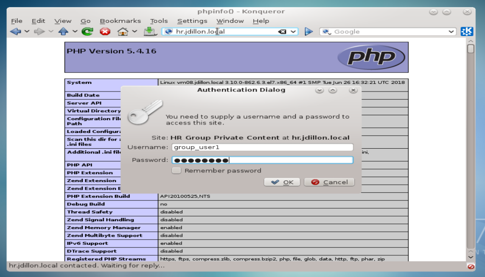
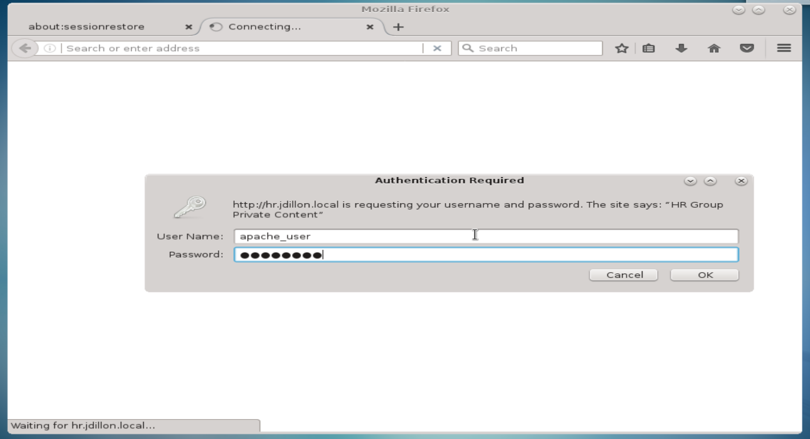
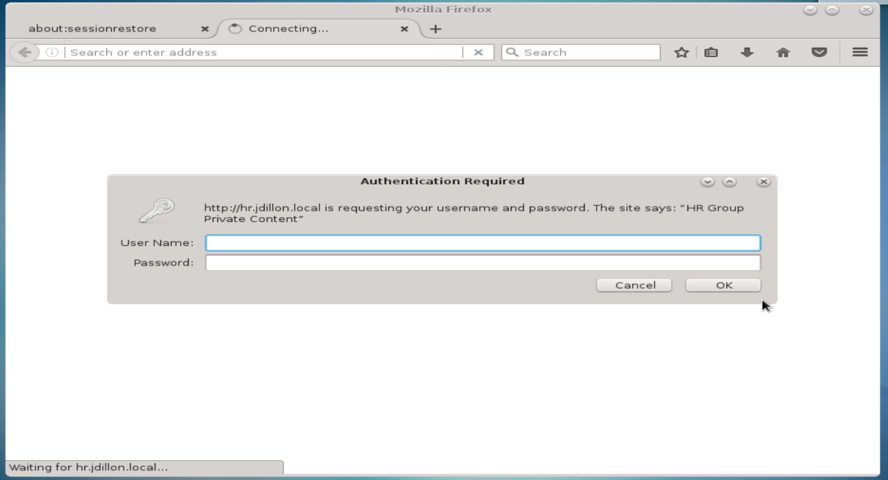

# Group Managed Content:

<hr><hr>

### Similar to enabling site access for a specific user, we can grant access on a group level.

### We will configure our VirtualHost hr to be a group access site, first we will create some users:

```
[root@vm08 conf]# for i in group_user{1..3}; do useradd $i;done
[root@vm08 conf]# ls /home
apache_user  group_user1  group_user2  group_user3  jdillon
```

### Create apache passwords for our new users:

```
[root@vm08 conf]# htpasswd -c /etc/httpd/htpasswd group_user1
New password:
Re-type new password:
Adding password for user group_user1
[root@vm08 conf]# htpasswd /etc/httpd/htpasswd group_user2
New password:
Re-type new password:
Adding password for user group_user2
[root@vm08 conf]# htpasswd /etc/httpd/htpasswd group_user3
New password:
Re-type new password:
Adding password for user group_user3
```

### It is important to note the the -c option creates a new htpasswd file, thus overwriting any pre-existing

### We can verify that our password hashes have been stored:

```
[root@vm08 conf]# cat /etc/httpd/htpasswd
group_user1:$apr1$Q0zBAgf1$6zO3EusaHlp.vDCUqOSdw/
group_user2:$apr1$alySjc/u$hpAHpkvbPLnV/JcHRfu2m1
group_user3:$apr1$AS1PwSZK$Lg6UZLrYhi.7TPjAOgzu7/
apache_user:$apr1$rKvsf.c1$JAc.xB528ppSJP2heqeyu1
```

### Create an httpd group file, listing members of the 'hr' group:

`[root@vm08 conf]# vim /etc/httpd/hr`

```
hr:  group_user1  group_user2  group_user3
```

### Next we must add a configuration to /etc/httpd/conf/httpd.conf:

```
<Directory "/web/hr">
    AuthType      Basic
    AuthName      "HR Group Private Content"
    AuthGroupFile /etc/httpd/hr
    AuthUserFile  /etc/httpd/htpasswd
    Require group hr
</Directory>
```

### We should check our current config syntax, and restart the httpd server:

```
[root@vm08 conf]# httpd -t
Syntax OK
[root@vm08 conf]# systemctl restart httpd
```

### Now we are ready to test site access via web-browser:



### When we authenticate via username and password of an hr group member, we are granted access:


### However, an Apache user that is not in the hr group will fail:





### Thus proving we have properly configured group-level site access

<hr><hr>

