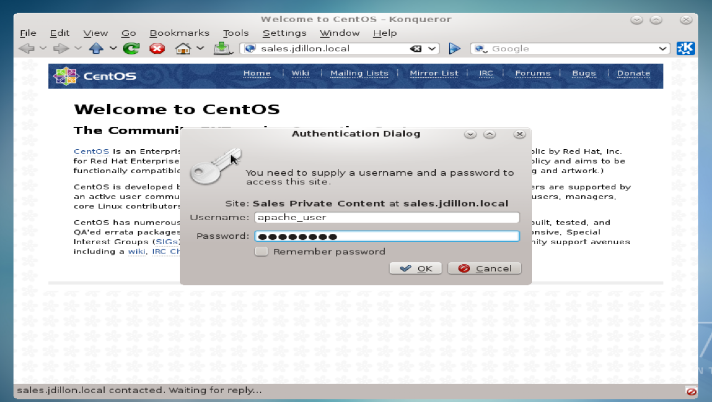
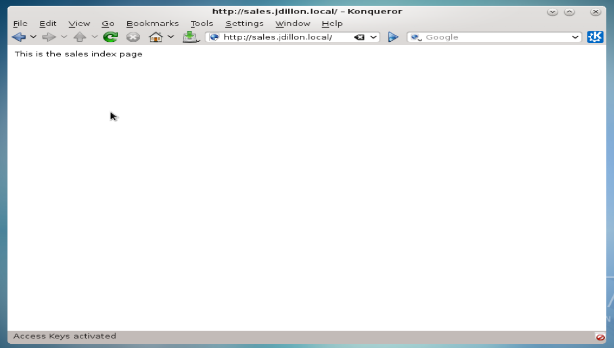

# Private Directory Configuration:

<hr><hr>

### Websites can be configured to use a username and password, by means of private directory configuration

### We will create a generic Apache user profile, with a password specific to directory/site access:

```
[root@vm08 ~]# useradd apache_user
[root@vm08 ~]# htpasswd -c /etc/htpasswd apache_user
New password:
Re-type new password:
Adding password for user apache_user
```

### We must now edit the Apache config file /etc/httpd/conf/httpd.conf, to specify a directory accessible only by this user:

`vim /etc/httpd/conf/httpd.conf`

```
<Directory "/web/sales">
    AuthType     Basic
    AuthName     "Sales Private Content"
    AuthUserFile /etc/httpd/htpasswd
    Require      valid-user
</Directory>
```

### We have added a directory parameter, adding password restricted access to our previousy created VirtualHost /web/sales

### We can restart the httpd service, and test access to the sales site via web-browser

```
[root@vm08 ~]# httpd -t
Syntax OK
[root@vm08 ~]# systemctl restart httpd
```

### When we point our browser to sales.jdillon.local, we should be greeted with a username/password prompt:



### Upon entering a valid username, and the specified Apache password we are granted access to the site content:



<hr><hr>
