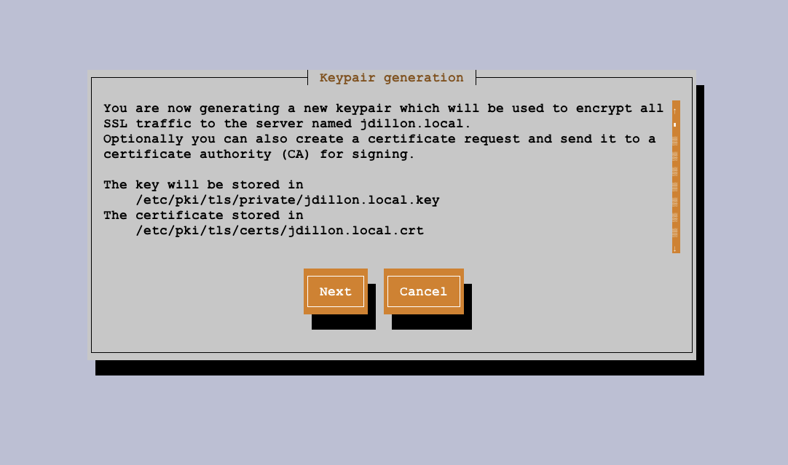
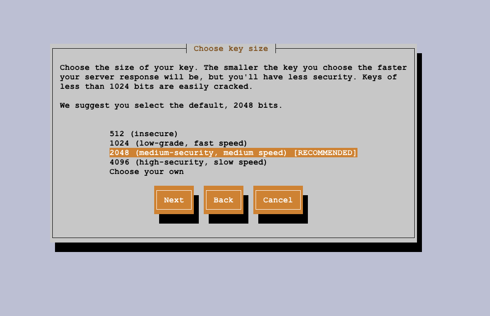
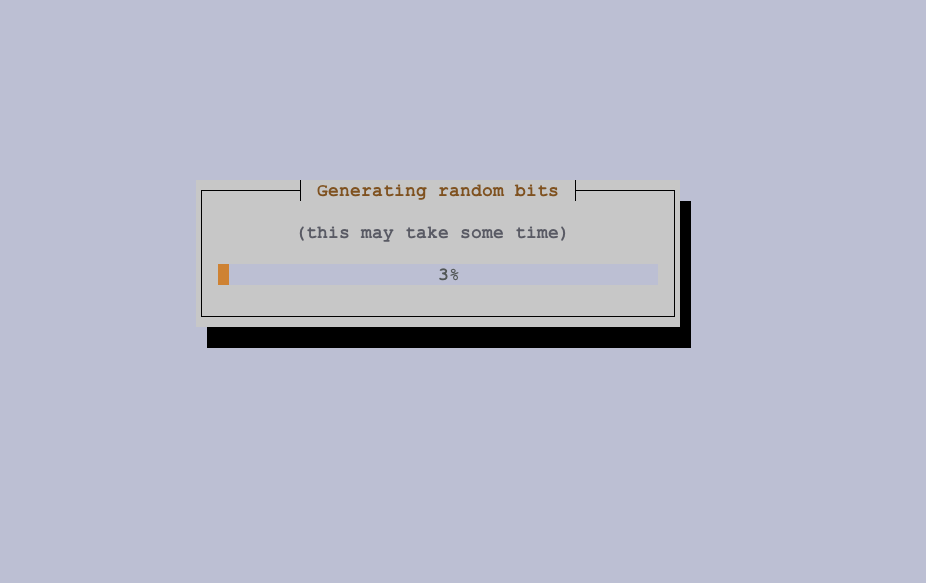
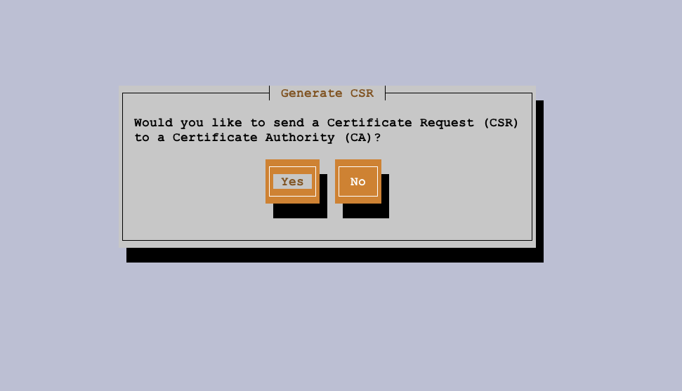
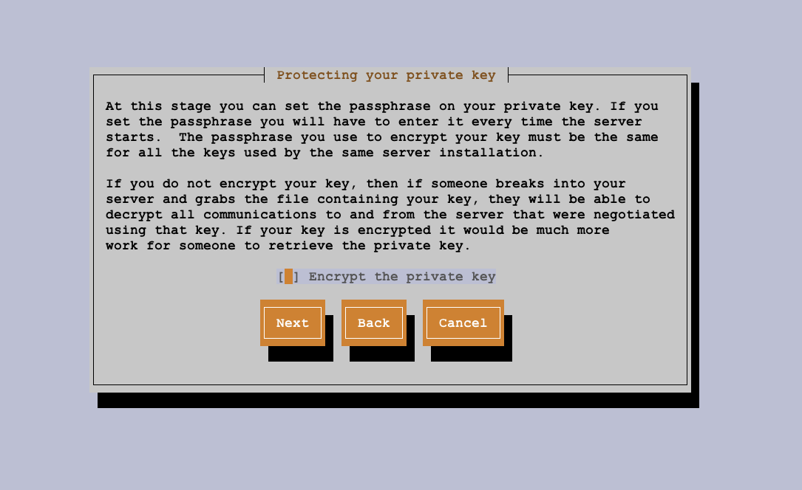
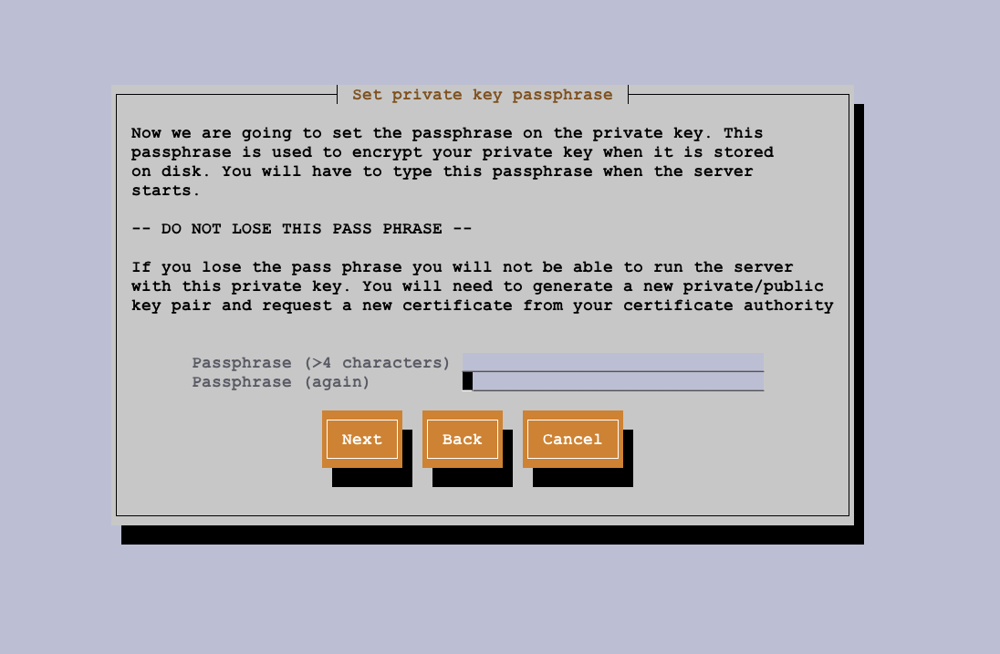
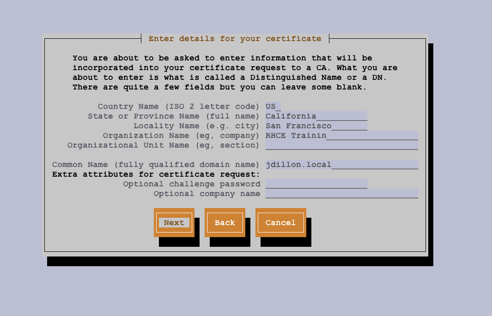
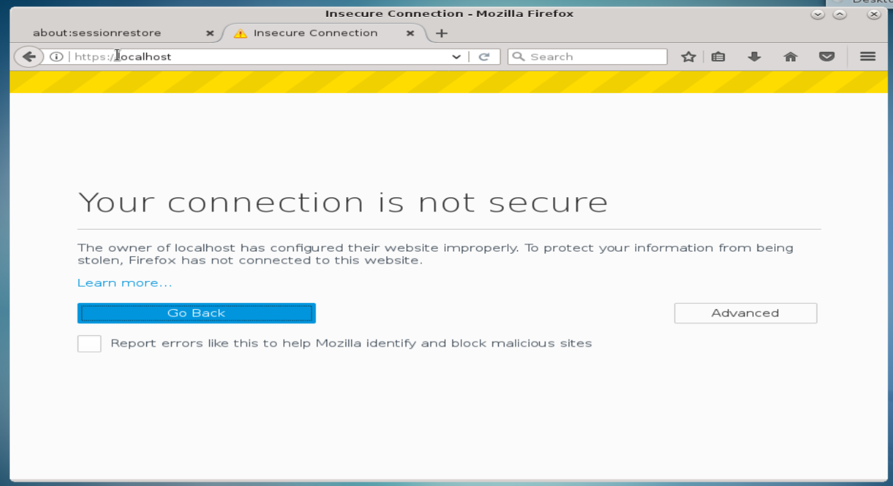
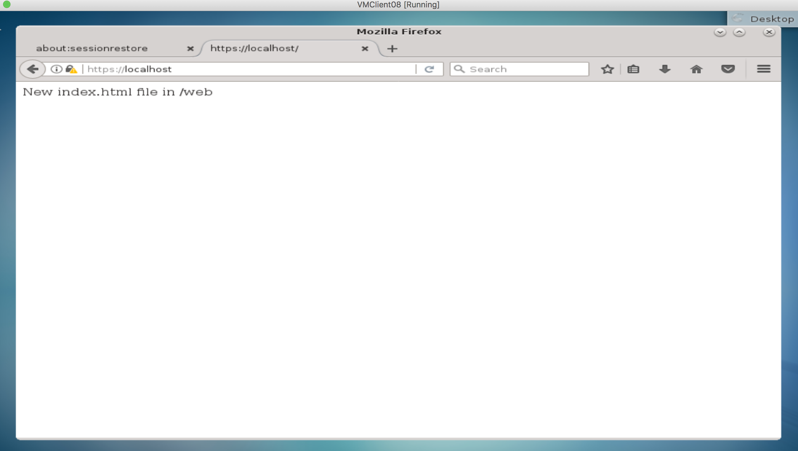

# Configuring TLS Security:

<hr><hr>

* In order to encrypt traffic between a client and a web-server, we need to configure TLS (Transport Layer Security)
* TLS will secure traffic from a 'Man in the Middle Attack'
* Without TLS configuration, any traffic between the server and client can be viewed across the web as clear text
* TLS uses encryption using a certificate and a signature
* There are two main certificate types:
  * 1). <strong>Signed Certificate</strong>: These certificates are signed ba a Certificate Authority.  The CA is a global organization that guarantees the authenticity of the signature that is used in the certificate.  Example Certificate Authorities are Digicert, Symantec, Godaddy.
  * 2). <strong>Self-Signed Certificate</strong>: A certificate that is not signed by a Certificate Authority.
* In order to sign a certificate by one of the CA organizations, we need to create a self-signed certificate and CSR (Certificate Service Request) file.  We can then send these files to one of the CA organizations, who will sign the certificate.

### We will start by installing the crypto-utils and mod_ssl packages for Apache:

```
[root@vm08 conf]# yum install -y crypto-utils mod_ssl
Loaded plugins: fastestmirror, langpacks
Loading mirror speeds from cached hostfile
 * base: mirror.tocici.com
 * extras: mirror.hmc.edu
 * updates: repos-lax.psychz.net
Resolving Dependencies
--> Running transaction check
---> Package crypto-utils.x86_64 0:2.4.1-42.el7 will be installed
--> Processing Dependency: perl(Newt) for package: crypto-utils-2.4.1-42.el7.x86_64
---> Package mod_ssl.x86_64 1:2.4.6-80.el7.centos.1 will be installed
--> Running transaction check
---> Package perl-Newt.x86_64 0:1.08-36.el7 will be installed
--> Finished Dependency Resolution

Dependencies Resolved

===========================================================================================================================================================
 Package                              Arch                           Version                                         Repository                       Size
===========================================================================================================================================================
Installing:
 crypto-utils                         x86_64                         2.4.1-42.el7                                    base                             78 k
 mod_ssl                              x86_64                         1:2.4.6-80.el7.centos.1                         updates                         111 k
Installing for dependencies:
 perl-Newt                            x86_64                         1.08-36.el7                                     base                             64 k

Transaction Summary
===========================================================================================================================================================
Install  2 Packages (+1 Dependent package)

Total download size: 253 k
Installed size: 570 k
Downloading packages:
(1/3): mod_ssl-2.4.6-80.el7.centos.1.x86_64.rpm                                                                                     | 111 kB  00:00:00
(2/3): crypto-utils-2.4.1-42.el7.x86_64.rpm                                                                                         |  78 kB  00:00:00
(3/3): perl-Newt-1.08-36.el7.x86_64.rpm                                                                                             |  64 kB  00:00:00
-----------------------------------------------------------------------------------------------------------------------------------------------------------
Total                                                                                                                      674 kB/s | 253 kB  00:00:00
Running transaction check
Running transaction test
Transaction test succeeded
Running transaction
  Installing : perl-Newt-1.08-36.el7.x86_64                                                                                                            1/3
  Installing : crypto-utils-2.4.1-42.el7.x86_64                                                                                                        2/3
  Installing : 1:mod_ssl-2.4.6-80.el7.centos.1.x86_64                                                                                                  3/3
  Verifying  : crypto-utils-2.4.1-42.el7.x86_64                                                                                                        1/3
  Verifying  : perl-Newt-1.08-36.el7.x86_64                                                                                                            2/3
  Verifying  : 1:mod_ssl-2.4.6-80.el7.centos.1.x86_64                                                                                                  3/3

Installed:
  crypto-utils.x86_64 0:2.4.1-42.el7                                         mod_ssl.x86_64 1:2.4.6-80.el7.centos.1

Dependency Installed:
  perl-Newt.x86_64 0:1.08-36.el7

Complete!

```

### Next, we will generate a key-pair for our domain (jdillon.local) using genkey:

`[root@vm08 conf]# genkey jdillon.local`



### We see that our key will be stored in /etc/pki/tls/private/jdillon.local.key, and our cert in /etc/pki/tls/certs/jdillon.local.crt

### Click next and proceed through the prompts:



### We will choose a medium security setting

### The key and certificate file will then be generated:



### When completed, we will be prompted to create a CSR file (this is the file we would send to the Certificate Authority):



### It is generally a good idea to encrypt the private key, we will select yes:




### We will then be prompted to enter certificate details:



### Entering certificate details should end the interactive session, our CSR has been generated:

```
/usr/bin/keyutil -c genreq -g 2048 -s "CN=jdillon.local, O=RHCE Trainin, L=San Francisco, ST=California, C=US" -v 24 -a -o /etc/pki/tls/certs/jdillon.local.0.csr -k /etc/pki/tls/private/jdillon.local.key -e "Str8x@xl" -z /etc/pki/tls/.rand.13140
cmdstr: genreq

cmd_CertReq
command:  genreq
keysize = 2048 bits
subject = CN=jdillon.local, O=RHCE Trainin, L=San Francisco, ST=California, C=US
valid for 24 months
output will be written to /etc/pki/tls/certs/jdillon.local.0.csr
output key written to /etc/pki/tls/private/jdillon.local.key
key encryption password = ****
random seed from /etc/pki/tls/.rand.13140


Generating key. This may take a few moments...

Made a key
Opened /etc/pki/tls/certs/jdillon.local.0.csr for writing
Wrote the CSR to /etc/pki/tls/certs/jdillon.local.0.csr
Wrote 1818 bytes of encoded data to /etc/pki/tls/private/jdillon.local.key
Wrote the key to:
/etc/pki/tls/private/jdillon.local.key
You now need to submit your CSR and documentation to your certificate
authority. Submitting your CSR may involve pasting it into an online
web form, or mailing it to a specific address. In either case, you
should include the BEGIN and END lines.

-----BEGIN NEW CERTIFICATE REQUEST-----
MIICrjCCAZYCAQAwaTELMAkGA1UEBhMCVVMxEzARBgNVBAgTCkNhbGlmb3JuaWEx
FjAUBgNVBAcTDVNhbiBGcmFuY2lzY28xFTATBgNVBAoTDFJIQ0UgVHJhaW5pbjEW
MBQGA1UEAxMNamRpbGxvbi5sb2NhbDCCASIwDQYJKoZIhvcNAQEBBQADggEPADCC
AQoCggEBAMxf8skOG/3oVJP+hCmTx15FA8k4YQOVF9nKGc5oF29OArwOXsYAzbrO
aTTg2QZkKf7SS3IEes/rLvn+io7QQ9RWcXcYHbFv0BdOe8jVF+sTL6C0ySPkpQHS
JNfj1Hz8GANtL7C7vgh6UH97UnkUSjmAiggHkX3X0muxB6CJT+Uu52i+ETfZXrgR
+mTDE7kH30Gy15Rdn1N/MDa+fDERIxP8gKwv3ZNxgoFnyWyEp0MyplwIOACPwGYt
tihF9je4Rd+z1oQd3aAg7hMWebF7wbL48hV4B0g0wspal4LNR7A7eRpOny5fxwPQ
AzCH1gOa73JSwrJNoLjoRrT0e/4jsZsCAwEAAaAAMA0GCSqGSIb3DQEBBQUAA4IB
AQB2ZgnroZPYlbKEfWmJxxsUFXARCh3wjX5Ky6shhJpSvVpRIpATXm6YSh9mQDZZ
xNvhqGvCS50GB0M0xw3qww3adTBDNcV/b36Da6e+DtRlfa6OxfAnDHJgNMz8cTt1
L1kyAmrJb1S3QCmVAwNMGsPWmwPPv/Ywg3LQm4MkKjyYXj2IA8zLbUAkhFruC1Xq
A6eCCh0s5T/0lrAQrmDK22immSDO6Frp9fsimkJTZpU+MaKdPeeXloxb8RkffkOU
L3W4pbsXLIGx0bL48zfTjrmxbdgsBk86Hac343v/J4usEVGLe8vbb1Dtt7jyPbw2
v/b726eRzoegj+xHhGRwbZUC
-----END NEW CERTIFICATE REQUEST-----


A copy of this CSR has been saved in the file
/etc/pki/tls/certs/jdillon.local.0.csr

Press return when ready to continue

```
### We would now be ready to send our newly created /etc/pki/tls/certs/jdillon.local.0.csr file to a Certificate Authority
### Once we received a signed crt file, we could name it 'jdillon.local.crt' and place it in the path '/etc/pki/tls/certs/'

### Now, we are ready to modify the /etc/httpd/conf.d/ssl.conf file (we will only be changing the path of the key and certificate files):

```
#   Server Certificate:
# Point SSLCertificateFile at a PEM encoded certificate.  If
# the certificate is encrypted, then you will be prompted for a
# pass phrase.  Note that a kill -HUP will prompt again.  A new
# certificate can be generated using the genkey(1) command.
SSLCertificateFile /etc/pki/tls/certs/jdillon.local.crt

#   Server Private Key:
#   If the key is not combined with the certificate, use this
#   directive to point at the key file.  Keep in mind that if
#   you've both a RSA and a DSA private key you can configure
#   both in parallel (to also allow the use of DSA ciphers, etc.)
SSLCertificateKeyFile /etc/pki/tls/private/jdillon.local.key
```

### We can now restart Apache and test our ssl configuration syntax:

```
[root@vm08 conf]# systemctl restart httpd
[root@vm08 conf]# httpd -t
Syntax OK
```

### Although our certificate is not yet signed, we can test our site in the browser.  It should now be accessible with an https prefix:



### This warning is to be expected, as our browser is telling us that the certificate has not yet been signed by a CA

### If we navigate to advanced settings, and add an exception for the site, we are granted access and can see that the site now has an https prefix:



<hr><hr>
