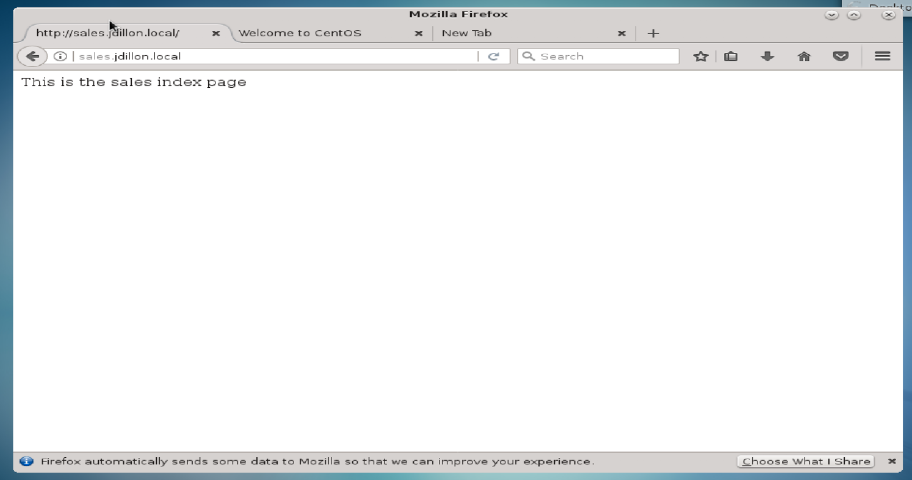

# VirtualHost Configuration:

<hr><hr>

### Our virtualhost will be created via name-based configuration.

### We will create new document roots in the /web directory:

```
[root@vm08 /]# cd /web
[root@vm08 web]# mkdir hr sales
[root@vm08 webl]# ls
hr  index.html  sales
[root@vm08 web]# touch hr/index.html
[root@vm08 web]# touch sales/index.html
[root@vm08 web]# chmod 644 hr/index.html sales/index.html
[root@vm08 web]# echo "This is the sales index page" >> sales/index.html
[root@vm08 web]# echo "This is the hr index page" >> hr/index.html
```

### We have created separate directories for 'hr' and 'sales', and placed an index.html file in each.

### We can now create modular configuration files for our new html directories:

```
[root@vm08 conf]# cd /etc/httpd/conf.d
[root@vm08 conf.d]# vim hr.conf
```

```
<VirtualHost 10.0.2.8:80>
    ServerAdmin    root@hr.jdillon.local
    ServerName     hr.jdillon.local
    DocumentRoot   /web/hr
    ErrorLog       "logs/hr_error_log"
    CustomLog      "logs/hr_access_log" combined
</VirtualHost>
```

### Create similar parameters for sales.conf

`[root@vm08 conf.d]# vim sales.conf`

```
<VirtualHost 10.0.2.8:80>
    ServerAdmin   root@sales.jdillon.local
    ServerName    sales.jdillon.local
    DocumentRoot  /web/sales
    ErrorLog      "logs/sales_error_log"
    CustomLog     "logs/sales_access_log" combined
</VirtualHost>
```

### Restart Apache:

```
[root@vm08 conf.d]# systemctl restart httpd
[root@vm08 conf.d]# systemctl status httpd
● httpd.service - The Apache HTTP Server
   Loaded: loaded (/usr/lib/systemd/system/httpd.service; enabled; vendor preset: disabled)
   Active: active (running) since Tue 2018-07-03 03:58:22 EDT; 5s ago
     Docs: man:httpd(8)
           man:apachectl(8)
  Process: 30206 ExecStop=/bin/kill -WINCH ${MAINPID} (code=exited, status=0/SUCCESS)
 Main PID: 30210 (httpd)
   Status: "Processing requests..."
   CGroup: /system.slice/httpd.service
           ├─30210 /usr/sbin/httpd -DFOREGROUND
           ├─30211 /usr/sbin/httpd -DFOREGROUND
           ├─30212 /usr/sbin/httpd -DFOREGROUND
           ├─30213 /usr/sbin/httpd -DFOREGROUND
           ├─30214 /usr/sbin/httpd -DFOREGROUND
           └─30215 /usr/sbin/httpd -DFOREGROUND

Jul 03 03:58:22 vm08.jdillon.local systemd[1]: Starting The Apache HTTP Server...
Jul 03 03:58:22 vm08.jdillon.local systemd[1]: Started The Apache HTTP Server.
```

### We can check the syntax of our various httpd configuration files using httpd -t:

```
[root@vm08 conf.d]# httpd -t
Syntax OK
```

### In order to access the virtualhosts, we must configure either DNS or the /etc/hosts file:

`[root@vm08 conf.d]# vim /etc/hosts`

```
127.0.0.1   localhost localhost.localdomain localhost4 localhost4.localdomain4
::1         localhost localhost.localdomain localhost6 localhost6.localdomain6
10.0.2.5    vm05.jdillon.local vm05
10.0.2.8    vm08.jdillon.local vm08 hr.jdillon.local sales.jdillon.local
10.0.2.6    masterhost06.jdillon.local masterhost06
10.0.2.7    vm07.jdillon.local vm07
10.0.2.9    vm09.jdillon.local vm09
```

### Per entry 10.0.2.8, we have added hr.jdillon.local and sales.jdillon.local

### We should now be ready to test our named virtualhosts in a web-browser:


### Localhost will point to the index file in our main document root directory 



### Sales.jdillon.local will point to the index file in /web/sales


### Hr.jdillon.local will point to the index file in /web/hr

### We now effectively have three separate domains served by a single Apache server

<hr><hr>
