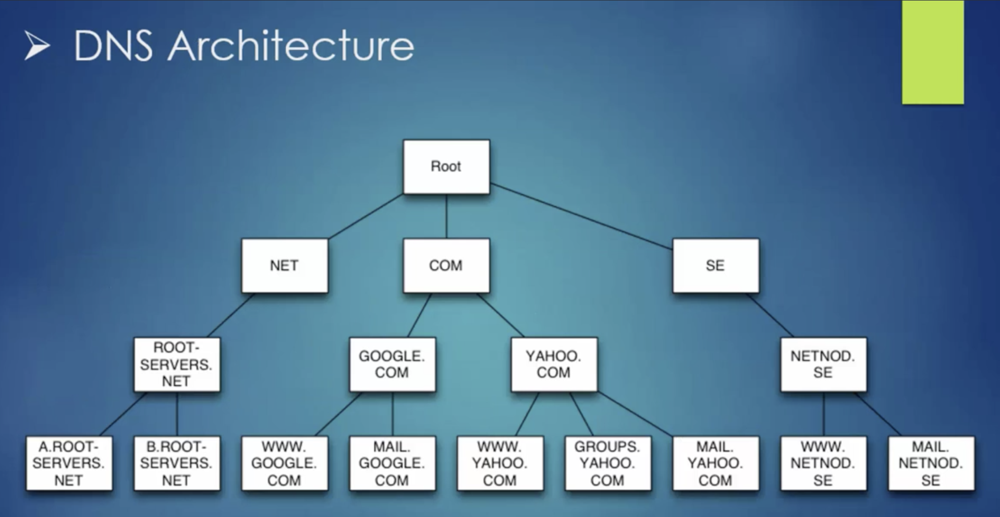

# DNS Notes:

Directory Contents:
* 1.) [Configuring Cache-Only DNS](Cache_Only_DNS)

## Understanding DNS Server

* DNS allows for resolution of domain names to their corresponding IP addresses.
* DNS structure consists of the Root Zone, the Root Zone contains the global list of the Top Level Domains (TLD) like:
  * .com
  * .net 
  * .org
  * .edu
* Root Zone also contains the internationalized top level domain (such as .se for Sweden) for corresponding country codes.
* Under the Top Level Domain, there are sub-domains:
  * For example: Google.com has a sub-domain as mail.google.com
* The default DNS package in CentOS7 & RHEL7 is 'Unbound DNS'.
* The main DNS configuration file is /etc/unbound/undound.conf.

## Dns Caching Process

* A client host wants access to Redhat.com, this query will be handled by the local DNS resolver, this resolver will search locall for a record of Redhat.com.
* If Redhat.com is not found locally, it will re-send the query to one of the root servers.
* The root server wil reply with the .com TLD.
* The resolver will send a query again to that .com TLD.
* The TLD will reply with the information of Redhat.com to the DNS resolver.
* The DNS resolver will reply the informatin to the client, the client then has access to it.
* These steps typically refer to the DNS Recursive process.
* It is very important to have a central DNS Cache Server to eliminate the time of resolving domains.
* DNS caching maintains domain information for a finite period of time.

## DNS Resource Records

* DNS records used to publish network services.
* Most commonly used types:
  * 1). <strong>A</strong> record: Maps the name to an IPv4 address.
  * 2). <strong>AAAA</strong> record: Maps the name to an Ipv6 address.
  * 3). <strong>CNAME</strong> record: An alias to a name.
  * 4). <strong>PTR</strong> record: Reverse DNS resolution (maps the name to an IP address.
  * 5). <strong>SOA</strong> record: Active Directory Record.
  * 6). <strong>MX</strong> record: Mail exchange record, responsible for e-mail service.

 
