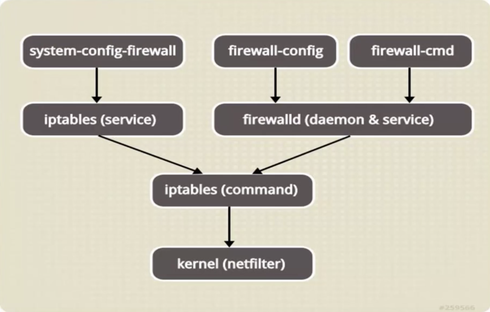

# FirewallD Notes:
<hr><hr>

## Directory Contents (Please configure steps in this order):

* 1.) [Rich Rules Configuration](Rich_Rules_Config)
* 2.) [NAT & Port Forwarding](NAT+Port_Forward)
* 3.) [Masquerade Configuration](Masquerade_Config)
* 4.) [Port Forwarding Configuration](Port_Forwarding_Config)

<hr><hr>

* FirewallD & Iptables both use the 'Netfilter' framework within the Linux Kernel.
* FirewallD is the default firewall daemon on Centos7 & RHEL7.
* The Iptables commands are used by FirewallD utilities.
* FirewallD coordinates zones:
  * Public
  * Internal
  * External
  * Intranet
  * Drop
  * DMZ
  * Home 
  * Block
  * Work
* The Default zone is 'Public'.  The zoning concept is to control the incoming traffic based on configured services, port-forwarding and rich rules.
* FirewallD supports both runtime and permanent configuration options.
* All FirewallD services are located in /usr/lib/firewalld/
* The main configuration file is /etc/firewalld/firewalld.conf

### FirewallD architecture configuration:



### We will explore some FirewallD configuration parameters on masterhost06 (10.0.2.6):

```
[root@masterhost06 ~]# cd /usr/lib/firewalld
[root@masterhost06 firewalld]# ls
helpers  icmptypes  ipsets  services  xmlschema  zones
```

### Individual XML files exist for various services handled by the firewall:

```
[root@masterhost06 firewalld]# cd services
[root@masterhost06 services]# ls
amanda-client.xml        kadmin.xml                puppetmaster.xml
amanda-k5-client.xml     kerberos.xml              quassel.xml
bacula-client.xml        kibana.xml                radius.xml
bacula.xml               klogin.xml                RH-Satellite-6.xml
bitcoin-rpc.xml          kpasswd.xml               rpc-bind.xml
bitcoin-testnet-rpc.xml  kshell.xml                rsh.xml
bitcoin-testnet.xml      ldaps.xml                 rsyncd.xml
bitcoin.xml              ldap.xml                  samba-client.xml
ceph-mon.xml             libvirt-tls.xml           samba.xml
ceph.xml                 libvirt.xml               sane.xml
cfengine.xml             managesieve.xml           sips.xml
condor-collector.xml     mdns.xml                  sip.xml
ctdb.xml                 mosh.xml                  smtp-submission.xml
dhcpv6-client.xml        mountd.xml                smtps.xml
dhcpv6.xml               mssql.xml                 smtp.xml
dhcp.xml                 ms-wbt.xml                snmptrap.xml
dns.xml                  mysql.xml                 snmp.xml
docker-registry.xml      nfs3.xml                  spideroak-lansync.xml
dropbox-lansync.xml      nfs.xml                   squid.xml
elasticsearch.xml        nrpe.xml                  ssh.xml
freeipa-ldaps.xml        ntp.xml                   synergy.xml
freeipa-ldap.xml         openvpn.xml               syslog-tls.xml
freeipa-replication.xml  ovirt-imageio.xml         syslog.xml
freeipa-trust.xml        ovirt-storageconsole.xml  telnet.xml
ftp.xml                  ovirt-vmconsole.xml       tftp-client.xml
ganglia-client.xml       pmcd.xml                  tftp.xml
ganglia-master.xml       pmproxy.xml               tinc.xml
high-availability.xml    pmwebapis.xml             tor-socks.xml
https.xml                pmwebapi.xml              transmission-client.xml
http.xml                 pop3s.xml                 vdsm.xml
imaps.xml                pop3.xml                  vnc-server.xml
imap.xml                 postgresql.xml            wbem-https.xml
ipp-client.xml           privoxy.xml               xmpp-bosh.xml
ipp.xml                  proxy-dhcp.xml            xmpp-client.xml
ipsec.xml                ptp.xml                   xmpp-local.xml
iscsi-target.xml         pulseaudio.xml            xmpp-server.xml
```

### These configuration files contain a description of the service, the use protocol, TCP or UDP, as well as the port number used.  For Example:

`[root@masterhost06 services]# vim ftp.xml`

```
<?xml version="1.0" encoding="utf-8"?>
<service>
  <short>FTP</short>
  <description>FTP is a protocol used for remote file transfer. If you plan to make your FTP server publicly available, enable this option. You need the vsftpd package installed for this option to be useful.</description>
  <port protocol="tcp" port="21"/>
  <module name="nf_conntrack_ftp"/>
</service>
```

### The same concept applies to 'Zone' configuration files:

```
[root@masterhost06 services]# cd ..
[root@masterhost06 firewalld]# ls
helpers  icmptypes  ipsets  services  xmlschema  zones
[root@masterhost06 firewalld]# cd zones
[root@masterhost06 zones]# ls
block.xml  drop.xml      home.xml      public.xml   work.xml
dmz.xml    external.xml  internal.xml  trusted.xml
[root@masterhost06 zones]# vim drop.xml
```

```
<?xml version="1.0" encoding="utf-8"?>
<zone target="DROP">
  <short>Drop</short>
  <description>Unsolicited incoming network packets are dropped. Incoming packets that are related to outgoing network connections are accepted. Outgoing network connections are allowed.</description>
</zone>
```

### FirewallD has both a GUI, and a command line interface.  The GUI can be accessed via the 'firewall-config' command:

`[root@masterhost06 zones]# firewall-config`


### This is a very simple interface for configuring zones and services to be handled by the firewall

### The command line interface is accessed via the 'firewall-cmd' command:

```
[root@masterhost06 zones]# firewall-cmd --get-default-zone
public
```

### This shows our current default zone as 'public'

### We can change our default zone temporarily:

```
[root@masterhost06 zones]# firewall-cmd --set-default-zone=external
success
```

### List services on the system:

```
[root@masterhost06 zones]# firewall-cmd --get-services
RH-Satellite-6 amanda-client amanda-k5-client bacula bacula-client bitcoin bitcoin-rpc bitcoin-testnet bitcoin-testnet-rpc ceph ceph-mon cfengine condor-collector ctdb dhcp dhcpv6 dhcpv6-client dns docker-registry dropbox-lansync elasticsearch freeipa-ldap freeipa-ldaps freeipa-replication freeipa-trust ftp ganglia-client ganglia-master high-availability http https imap imaps ipp ipp-client ipsec iscsi-target kadmin kerberos kibana klogin kpasswd kshell ldap ldaps libvirt libvirt-tls managesieve mdns mosh mountd ms-wbt mssql mysql nfs nfs3 nrpe ntp openvpn ovirt-imageio ovirt-storageconsole ovirt-vmconsole pmcd pmproxy pmwebapi pmwebapis pop3 pop3s postgresql privoxy proxy-dhcp ptp pulseaudio puppetmaster quassel radius rpc-bind rsh rsyncd samba samba-client sane sip sips smtp smtp-submission smtps snmp snmptrap spideroak-lansync squid ssh synergy syslog syslog-tls telnet tftp tftp-client tinc tor-socks transmission-client vdsm vnc-server wbem-https xmpp-bosh xmpp-client xmpp-local xmpp-server
```

### List only those services that are controlled by the firewall:

```
[root@masterhost06 zones]# firewall-cmd --list-all
external (active)
  target: default
  icmp-block-inversion: no
  interfaces: enp0s9
  sources:
  services: ssh
  ports:
  protocols:
  masquerade: yes
  forward-ports:
  source-ports:
  icmp-blocks:
  rich rules:
```

### We currently see our only active interface (enp0s9), the ssh service, and that masquerade is currently in effect

### We can check the current status of the firewall (specifically whethere running or not):

```
[root@masterhost06 zones]# firewall-cmd --state
running
```

### Note that FirewallD is itself a service, whose state can be queried, stopped, started or disabled via 'systemctl':

```
[root@masterhost06 zones]# systemctl status firewalld
● firewalld.service - firewalld - dynamic firewall daemon
   Loaded: loaded (/usr/lib/systemd/system/firewalld.service; enabled; vendor preset: enabled)
   Active: active (running) since Tue 2018-06-05 05:07:24 EDT; 23min ago
     Docs: man:firewalld(1)
 Main PID: 731 (firewalld)
   CGroup: /system.slice/firewalld.service
           └─731 /usr/bin/python -Es /usr/sbin/firewalld --nofork --nopid

Jun 05 05:07:22 masterhost06.jdillon.local systemd[1]: Starting firewalld - dynamic ....
Jun 05 05:07:24 masterhost06.jdillon.local systemd[1]: Started firewalld - dynamic f....
Hint: Some lines were ellipsized, use -l to show in full.
```

### As we move on, we will work with specific features of the firewall: rich-rules, masquerading & port-forwarding.

<hr><hr>
